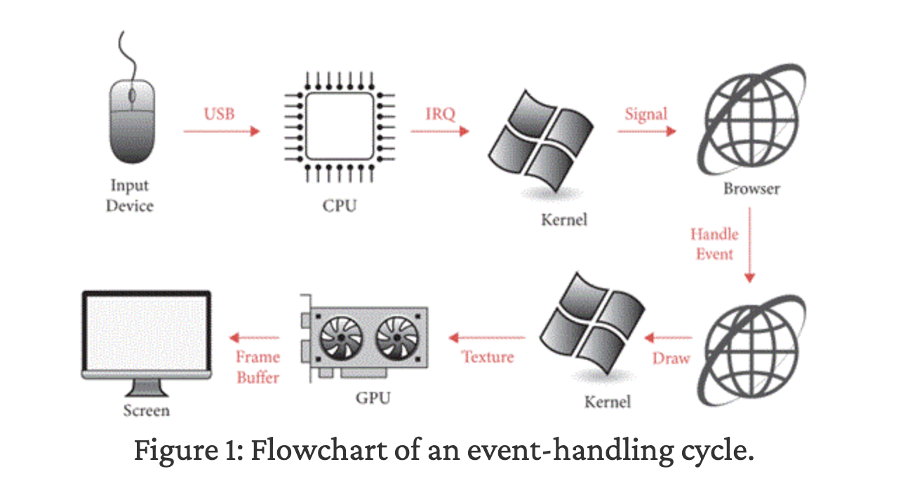

# Browser

## How it started

While preparing for my job interview, I realized that my knowledge related web technologies was pretty shallow. I asked myself: what could be a good way for me to learn more deeply about web technologies and understand in more depth? Sure, I could go and buy a book or watch some youtube videos about it, but then an idea clicked inside me: Why not create a web browser for myself?

Along this journey, I decided to follow this course: [Web Browser Engineering](https://browser.engineering/index.html).

# What I've learned

Sharing shamelessly all the questions and answers that I asked myself while going through this project.

## Why does python uses Socket? Why doesn't it use HTTP (fetch)?

> **TL;DR**  
> Browsers do not use "HTTP" as an external library.  
> They implement HTTP themselves on top of sockets.  
> HTTP is just a protocol.

### Socket & TCP

Socket is an interface, and TCP is an actual technology for a connection.

### HTTP

My misconecption is fixed here: HTTP is a _protocol_. Basically a promise / standard with set of rules that is agreed upon between machines that when communicating with each other.

Nutshell: HTTP defines how information is structured, TCP provides the connection, sockets are API used by programs to access TCP.

Thus, from the OS's point of view, HTTP request is just bytes written to a TCP socket.

`Browser -> HTTP -> TCP (accessed via sockets) -> IP -> Ethernet / Wifi`

## Event-handling cycle

